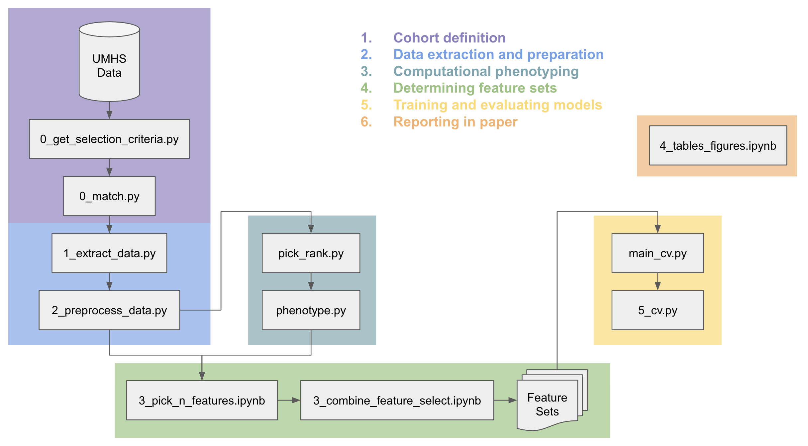

# interpretable-ami-prediction
Code and results repository for study to evaluate interpretable models' ability to predict acute myocardial infarctions in patients without pre-existing cardiac conditions using outpatient data.

## Workflow

## Phenotypes
| Feature                                                                                   | Phenotype | Weight |
| ----------------------------------------------------------------------------------------- | --------- | ------ |
| LISINOPRIL 10mg tablet                                                                    | 0         | 0.0171 |
| ATORVASTATIN 10mg tablet                                                                  | 0         | 0.0018 |
| metFORMIN (GLUCOPHAGE) 1,000 mg tablet                                                    | 0         | 0.0015 |
| FUROSEMIDE 20mg tablet                                                                    | 0         | 0.0008 |
| HYDROCHLOROTHIAZIDE 25mg tablet                                                           | 0         | 0.0007 |
| insulin glargine (LANTUS SOLOSTAR) 100 unit/mL injection pen                              | 0         | 0.0006 |
| pravastatin (PRAVACHOL) 40 mg tablet                                                      | 0         | 0.0006 |
| spironolactone (ALDACTONE) 25 mg tablet                                                   | 0         | 0.0005 |
| simvastatin (ZOCOR) 20 mg tablet                                                          | 0         | 0.0005 |
| ibuprofen (MOTRIN) 800 mg tablet                                                          | 0         | 0.0005 |
| ----------------------------------------------------------------------------------------- | --------- | ------ |
| Age-related cataract (H25)                                                                | 1         | 0.0184 |
| Age-related nuclear cataract, bilateral (H2513)                                           | 1         | 0.0106 |
| Disorders of vitreous body (H43)                                                          | 1         | 0.0063 |
| Age-related nuclear cataract, unspecified eye (H2510)                                     | 1         | 0.0034 |
| Vitreous degeneration, bilateral (H43813)                                                 | 1         | 0.0033 |
| Combined forms of age-related cataract, bilateral (H25813)                                | 1         | 0.0021 |
| Unspecified disorder of refraction (H527)                                                 | 1         | 0.0018 |
| Unspecified age-related cataract (H259)                                                   | 1         | 0.0014 |
| Vitreous degeneration, right eye (H43811)                                                 | 1         | 0.0012 |
| Age-related nuclear cataract, left eye (H2512)                                            | 1         | 0.0012 |
| ----------------------------------------------------------------------------------------- | --------- | ------ |
| Type 2 diabetes mellitus (E11)                                                            | 2         | 0.0174 |
| Type 2 diabetes mellitus without complications (E119)                                     | 2         | 0.0149 |
| metFORMIN (GLUCOPHAGE) 1,000 mg tablet                                                    | 2         | 0.0038 |
| Type 2 diabetes mellitus with hyperglycemia (E1165)                                       | 2         | 0.0026 |
| insulin glargine (LANTUS SOLOSTAR) 100 unit/mL injection pen                              | 2         | 0.0018 |
| blood sugar diagnostic (GLUCOSE BLOOD) Strip                                              | 2         | 0.0017 |
| Type 2 diabetes mellitus with diabetic polyneuropathy (E1142)                             | 2         | 0.0016 |
| Essential (primary) hypertension (I10)                                                    | 2         | 0.0016 |
| metFORMIN (GLUCOPHAGE XR) 500 mg 24 hr tablet                                             | 2         | 0.0014 |
| Type 2 diabetes mellitus with unspecified complications (E118)                            | 2         | 0.0014 |
| ----------------------------------------------------------------------------------------- | --------- | ------ |
| Abdominal and pelvic pain (R10)                                                           | 3         | 0.0185 |
| Nausea and vomiting (R11)                                                                 | 3         | 0.0094 |
| Unspecified abdominal pain (R109)                                                         | 3         | 0.0081 |
| Other symptoms and signs involving the digestive system and abdomen (R19)                 | 3         | 0.0057 |
| Other functional intestinal disorders (K59)                                               | 3         | 0.0055 |
| Constipation, unspecified (K5900)                                                         | 3         | 0.0050 |
| Nausea with vomiting, unspecified (R112)                                                  | 3         | 0.0050 |
| Nausea (R110)                                                                             | 3         | 0.0050 |
| Malaise and fatigue (R53)                                                                 | 3         | 0.0049 |
| Diarrhea, unspecified (R197)                                                              | 3         | 0.0046 |
| ----------------------------------------------------------------------------------------- | --------- | ------ |
| FLUTICASONE 50 MCG/ACTUATION NASAL SPRAY,SUSPENSION                                       | 4         | 0.0310 |
| loratadine (CLARITIN) 10 mg tablet                                                        | 4         | 0.0056 |
| MONTELUKAST 10mg tablet                                                                   | 4         | 0.0041 |
| Vasomotor and allergic rhinitis (J30)                                                     | 4         | 0.0040 |
| CETIRIZINE 10mg tablet                                                                    | 4         | 0.0025 |
| Other seasonal allergic rhinitis (J302)                                                   | 4         | 0.0013 |
| Cough (R05)                                                                               | 4         | 0.0012 |
| cholecalciferol (VITAMIN D3) 2,000 unit capsule                                           | 4         | 0.0010 |
| Other allergic rhinitis (J3089)                                                           | 4         | 0.0010 |
| FUROSEMIDE 20mg tablet                                                                    | 4         | 0.0010 |
| ----------------------------------------------------------------------------------------- | --------- | ------ |
| Essential (primary) hypertension (I10)                                                    | 5         | 0.0330 |
| Disorders of lipoprotein metabolism and other lipidemias (E78)                            | 5         | 0.0330 |
| Hyperlipidemia, unspecified (E785)                                                        | 5         | 0.0264 |
| Pure hypercholesterolemia, unspecified (E7800)                                            | 5         | 0.0032 |
| Mixed hyperlipidemia (E782)                                                               | 5         | 0.0028 |
| Elevated blood glucose level (R73)                                                        | 5         | 0.0025 |
| Sleep disorders (G47)                                                                     | 5         | 0.0024 |
| ACETAMINOPHEN 325mg tablet                                                                | 5         | 0.0022 |
| DOCUSATE SODIUM 100mg CAPSULE                                                             | 5         | 0.0022 |
| Chronic obstructive pulmonary disease, unspecified (J449)                                 | 5         | 0.0022 |
| ----------------------------------------------------------------------------------------- | --------- | ------ |
| ATORVASTATIN 40mg tablet                                                                  | 6         | 0.0214 |
| AMLODIPINE 10mg tablet                                                                    | 6         | 0.0095 |
| CLOPIDOGREL 75mg tablet                                                                   | 6         | 0.0050 |
| lisinopril (ZESTRIL) 40 mg tablet                                                         | 6         | 0.0025 |
| METOPROLOL SUCCINATE ER 25mg tablet,EXTENDED RELEASE 24 HR                                | 6         | 0.0016 |
| insulin glargine (LANTUS SOLOSTAR) 100 unit/mL injection pen                              | 6         | 0.0014 |
| LOSARTAN 50mg tablet                                                                      | 6         | 0.0009 |
| METOPROLOL TARTRATE 25mg tablet                                                           | 6         | 0.0009 |
| ASPIRIN 325mg tablet                                                                      | 6         | 0.0009 |
| hydrochlorothiazide 12.5 mg tablet                                                        | 6         | 0.0008 |
| ----------------------------------------------------------------------------------------- | --------- | ------ |
| Disorders of refraction and accommodation (H52)                                           | 7         | 0.0121 |
| Unspecified cataract (H269)                                                               | 7         | 0.0064 |
| Other cataract (H26)                                                                      | 7         | 0.0064 |
| Presbyopia (H524)                                                                         | 7         | 0.0062 |
| Myopia, bilateral (H5213)                                                                 | 7         | 0.0057 |
| Unspecified astigmatism, bilateral (H52203)                                               | 7         | 0.0036 |
| Hypermetropia, bilateral (H5203)                                                          | 7         | 0.0033 |
| Disorders of vitreous body (H43)                                                          | 7         | 0.0029 |
| Disorders of lacrimal system (H04)                                                        | 7         | 0.0018 |
| Glaucoma (H40)                                                                            | 7         | 0.0014 |
| ----------------------------------------------------------------------------------------- | --------- | ------ |
| Disorders of lipoprotein metabolism and other lipidemias (E78)                            | 8         | 0.0270 |
| Hyperlipidemia, unspecified (E785)                                                        | 8         | 0.0216 |
| Mixed hyperlipidemia (E782)                                                               | 8         | 0.0027 |
| Benign neoplasm of colon, rectum, anus and anal canal (D12)                               | 8         | 0.0018 |
| Benign neoplasm of colon, unspecified (D126)                                              | 8         | 0.0015 |
| SIMVASTATIN 40mg tablet                                                                   | 8         | 0.0015 |
| ATORVASTATIN 10mg tablet                                                                  | 8         | 0.0015 |
| Male erectile dysfunction, unspecified (N529)                                             | 8         | 0.0013 |
| Male erectile dysfunction (N52)                                                           | 8         | 0.0013 |
| Pure hypercholesterolemia, unspecified (E7800)                                            | 8         | 0.0013 |
| ----------------------------------------------------------------------------------------- | --------- | ------ |
| Type 2 diabetes mellitus (E11)                                                            | 9         | 0.1577 |
| Type 2 diabetes mellitus without complications (E119)                                     | 9         | 0.1381 |
| Type 2 diabetes mellitus with hyperglycemia (E1165)                                       | 9         | 0.0213 |
| metFORMIN (GLUCOPHAGE) 1,000 mg tablet                                                    | 9         | 0.0195 |
| Type 2 diabetes mellitus with unspecified complications (E118)                            | 9         | 0.0168 |
| insulin glargine (LANTUS SOLOSTAR) 100 unit/mL injection pen                              | 9         | 0.0128 |
| metFORMIN (GLUCOPHAGE XR) 500 mg 24 hr tablet                                             | 9         | 0.0118 |
| Type 2 diabetes mellitus with diabetic neuropathy, unspecified (E1140)                    | 9         | 0.0104 |
| Type 2 diabetes mellitus with diabetic polyneuropathy (E1142)                             | 9         | 0.0102 |
| blood sugar diagnostic (GLUCOSE BLOOD) Strip                                              | 9         | 0.0100 |
| ----------------------------------------------------------------------------------------- | --------- | ------ |
| Gastro-esophageal reflux disease (K21)                                                    | 10        | 0.0180 |
| Gastro-esophageal reflux disease without esophagitis (K219)                               | 10        | 0.0174 |
| omeprazole (PRILOSEC) 40 mg delayed release capsule                                       | 10        | 0.0031 |
| RANITIDINE 150mg tablet                                                                   | 10        | 0.0022 |
| Asthma (J45)                                                                              | 10        | 0.0021 |
| Aphagia and dysphagia (R13)                                                               | 10        | 0.0016 |
| Diaphragmatic hernia without obstruction or gangrene (K449)                               | 10        | 0.0016 |
| Diaphragmatic hernia (K44)                                                                | 10        | 0.0016 |
| Dysphagia, unspecified (R1310)                                                            | 10        | 0.0015 |
| Vasomotor and allergic rhinitis (J30)                                                     | 10        | 0.0014 |
| ----------------------------------------------------------------------------------------- | --------- | ------ |
| Hypothyroidism, unspecified (E039)                                                        | 11        | 0.1200 |
| Other hypothyroidism (E03)                                                                | 11        | 0.1200 |
| LEVOTHYROXINE 50 MCG tablet                                                               | 11        | 0.0126 |
| LEVOTHYROXINE 75 MCG tablet                                                               | 11        | 0.0123 |
| LEVOTHYROXINE 100 MCG tablet                                                              | 11        | 0.0120 |
| Other disorders of urinary system (N39)                                                   | 11        | 0.0104 |
| levothyroxine (SYNTHROID) 125 mcg tablet                                                  | 11        | 0.0099 |
| Malaise and fatigue (R53)                                                                 | 11        | 0.0098 |
| Other and unspecified osteoarthritis (M19)                                                | 11        | 0.0085 |
| Unspecified osteoarthritis, unspecified site (M1990)                                      | 11        | 0.0085 |
| ----------------------------------------------------------------------------------------- | --------- | ------ |
| TAMSULOSIN ER 0.4mg CAPSULE,EXTENDED RELEASE 24 HR                                        | 12        | 0.0901 |
| Benign prostatic hyperplasia (N40)                                                        | 12        | 0.0307 |
| Malignant neoplasm of prostate (C61)                                                      | 12        | 0.0252 |
| Benign prostatic hyperplasia with lower urinary tract symptoms (N401)                     | 12        | 0.0201 |
| Benign prostatic hyperplasia without lower urinary tract symptoms (N400)                  | 12        | 0.0149 |
| FINASTERIDE 5mg tablet                                                                    | 12        | 0.0149 |
| Abnormal tumor markers (R97)                                                              | 12        | 0.0136 |
| Polyuria (R35)                                                                            | 12        | 0.0117 |
| Retention of urine (R33)                                                                  | 12        | 0.0112 |
| Retention of urine, unspecified (R339)                                                    | 12        | 0.0112 |
| ----------------------------------------------------------------------------------------- | --------- | ------ |
| HYDROCODONE 5mg-ACETAMINOPHEN 325mg tablet                                                | 13        | 0.1814 |
| IBUPROFEN 600mg tablet                                                                    | 13        | 0.0379 |
| ibuprofen (MOTRIN) 800 mg tablet                                                          | 13        | 0.0228 |
| ERGOCALCIFEROL (VITAMIN D2) (VITAMIN D ORAL)                                              | 13        | 0.0153 |
| DOCUSATE SODIUM 100mg CAPSULE                                                             | 13        | 0.0131 |
| CYCLOBENZAPRINE 10mg tablet                                                               | 13        | 0.0112 |
| CYCLOBENZAPRINE 5mg tablet                                                                | 13        | 0.0111 |
| ONDANSETRON 4mg DISINTEGRATING tablet                                                     | 13        | 0.0103 |
| SULFAMETHOXAZOLE 800mg-TRIMETHOPRIM 160mg tablet                                          | 13        | 0.0059 |
| polyethylene glycol 3350 (MIRALAX) 17 g/dose powder                                       | 13        | 0.0058 |
| ----------------------------------------------------------------------------------------- | --------- | ------ |
| Overweight and obesity (E66)                                                              | 14        | 0.0349 |
| Obesity, unspecified (E669)                                                               | 14        | 0.0235 |
| Morbid (severe) obesity due to excess calories (E6601)                                    | 14        | 0.0126 |
| Essential (primary) hypertension (I10)                                                    | 14        | 0.0053 |
| Elevated blood glucose level (R73)                                                        | 14        | 0.0044 |
| OXYCODONE 5mg tablet                                                                      | 14        | 0.0035 |
| Prediabetes (R7303)                                                                       | 14        | 0.0031 |
| Obstructive sleep apnea (adult) (pediatric) (G4733)                                       | 14        | 0.0030 |
| Sleep disorders (G47)                                                                     | 14        | 0.0030 |
| Other disorders of urinary system (N39)                                                   | 14        | 0.0027 |
| ----------------------------------------------------------------------------------------- | --------- | ------ |
| Major depressive disorder, single episode, unspecified (F329)                             | 15        | 0.0192 |
| Major depressive disorder, single episode (F32)                                           | 15        | 0.0192 |
| SERTRALINE 100mg tablet                                                                   | 15        | 0.0033 |
| buPROPion (WELLBUTRIN XL) 300 mg 24 hr tablet                                             | 15        | 0.0025 |
| TRAZODONE 50mg tablet                                                                     | 15        | 0.0024 |
| BUPROPION HCL XL 150mg 24 HR tablet, EXTENDED RELEASE                                     | 15        | 0.0020 |
| DULOXETINE 60mg CAPSULE,DELAYED RELEASE                                                   | 15        | 0.0019 |
| TRAZODONE 100mg tablet                                                                    | 15        | 0.0014 |
| FLUOXETINE 20mg CAPSULE                                                                   | 15        | 0.0014 |
| CITALOPRAM 20mg tablet                                                                    | 15        | 0.0013 |
| ----------------------------------------------------------------------------------------- | --------- | ------ |
| Overweight and obesity (E66)                                                              | 16        | 0.0509 |
| Obesity, unspecified (E669)                                                               | 16        | 0.0292 |
| Morbid (severe) obesity due to excess calories (E6601)                                    | 16        | 0.0218 |
| Elevated blood glucose level (R73)                                                        | 16        | 0.0095 |
| Prediabetes (R7303)                                                                       | 16        | 0.0068 |
| Vitamin D deficiency, unspecified (E559)                                                  | 16        | 0.0042 |
| Vitamin D deficiency (E55)                                                                | 16        | 0.0042 |
| Overweight (E663)                                                                         | 16        | 0.0032 |
| ibuprofen (MOTRIN) 800 mg tablet                                                          | 16        | 0.0031 |
| Other obesity due to excess calories (E6609)                                              | 16        | 0.0025 |
| ----------------------------------------------------------------------------------------- | --------- | ------ |
| peg 3350-electrolytes (TRILYTE WITH FLAVOR PACKETS) 420 gram solution                     | 17        | 0.0376 |
| Benign neoplasm of colon, rectum, anus and anal canal (D12)                               | 17        | 0.0111 |
| Benign neoplasm of colon, unspecified (D126)                                              | 17        | 0.0055 |
| Elevated blood glucose level (R73)                                                        | 17        | 0.0033 |
| Other diseases of intestine (K63)                                                         | 17        | 0.0032 |
| Polyp of colon (K635)                                                                     | 17        | 0.0028 |
| Prediabetes (R7303)                                                                       | 17        | 0.0027 |
| Benign neoplasm of transverse colon (D123)                                                | 17        | 0.0027 |
| Diverticular disease of intestine (K57)                                                   | 17        | 0.0026 |
| Diverticulosis of large intestine without perforation or abscess without bleeding (K5730) | 17        | 0.0026 |
| ----------------------------------------------------------------------------------------- | --------- | ------ |
| ASPIRIN 81mg CHEWABLE tablet                                                              | 18        | 0.0678 |
| ATORVASTATIN 10mg tablet                                                                  | 18        | 0.0035 |
| LATANOPROST 0.005 % EYE DROPS                                                             | 18        | 0.0030 |
| SIMVASTATIN 40mg tablet                                                                   | 18        | 0.0030 |
| CETIRIZINE 10mg tablet                                                                    | 18        | 0.0029 |
| CLOPIDOGREL 75mg tablet                                                                   | 18        | 0.0029 |
| HYDROCHLOROTHIAZIDE 25mg tablet                                                           | 18        | 0.0028 |
| METOPROLOL TARTRATE 25mg tablet                                                           | 18        | 0.0028 |
| lisinopril-hydrochlorothiazide (ZESTORETIC) 20-12.5 mg tablet                             | 18        | 0.0027 |
| omeprazole (PRILOSEC) 40 mg delayed release capsule                                       | 18        | 0.0026 |
| ----------------------------------------------------------------------------------------- | --------- | ------ |
| Dorsalgia (M54)                                                                           | 19        | 0.0092 |
| Pain, not elsewhere classified (G89)                                                      | 19        | 0.0079 |
| Other chronic pain (G8929)                                                                | 19        | 0.0076 |
| Low back pain (M545)                                                                      | 19        | 0.0056 |
| Cervicalgia (M542)                                                                        | 19        | 0.0018 |
| CYCLOBENZAPRINE 10mg tablet                                                               | 19        | 0.0016 |
| Other joint disorder, not elsewhere classified (M25)                                      | 19        | 0.0014 |
| Lumbago with sciatica, right side (M5441)                                                 | 19        | 0.0012 |
| Dorsalgia, unspecified (M549)                                                             | 19        | 0.0011 |
| Spondylosis (M47)                                                                         | 19        | 0.0010 |
| ----------------------------------------------------------------------------------------- | --------- | ------ |
| FOLIC ACID 1mg tablet                                                                     | 20        | 0.0130 |
| PREDNISONE 5mg tablet                                                                     | 20        | 0.0103 |
| Other disorders involving the immune mechanism, not elsewhere classified (D89)            | 20        | 0.0094 |
| Disorder involving the immune mechanism, unspecified (D899)                               | 20        | 0.0094 |
| hydroxychloroquine (PLAQUENIL) 200 mg tablet                                              | 20        | 0.0077 |
| methotrexate 2.5 mg tablet                                                                | 20        | 0.0075 |
| Rheumatoid arthritis, unspecified (M069)                                                  | 20        | 0.0069 |
| Other rheumatoid arthritis (M06)                                                          | 20        | 0.0069 |
| ATORVASTATIN 10mg tablet                                                                  | 20        | 0.0055 |
| PREDNISONE 10mg tablet                                                                    | 20        | 0.0043 |
| ----------------------------------------------------------------------------------------- | --------- | ------ |
| Disorders of lipoprotein metabolism and other lipidemias (E78)                            | 21        | 0.0297 |
| Essential (primary) hypertension (I10)                                                    | 21        | 0.0293 |
| Hyperlipidemia, unspecified (E785)                                                        | 21        | 0.0237 |
| Gastro-esophageal reflux disease (K21)                                                    | 21        | 0.0106 |
| Gastro-esophageal reflux disease without esophagitis (K219)                               | 21        | 0.0102 |
| Overweight and obesity (E66)                                                              | 21        | 0.0085 |
| Type 2 diabetes mellitus (E11)                                                            | 21        | 0.0076 |
| Sleep disorders (G47)                                                                     | 21        | 0.0064 |
| Obesity, unspecified (E669)                                                               | 21        | 0.0060 |
| Pain, not elsewhere classified (G89)                                                      | 21        | 0.0056 |
| ----------------------------------------------------------------------------------------- | --------- | ------ |
| GABAPENTIN 300mg CAPSULE                                                                  | 22        | 0.0109 |
| TRAMADOL 50mg tablet                                                                      | 22        | 0.0045 |
| TRAZODONE 50mg tablet                                                                     | 22        | 0.0011 |
| CYCLOBENZAPRINE 10mg tablet                                                               | 22        | 0.0009 |
| HYDROCODONE 10mg-ACETAMINOPHEN 325mg tablet                                               | 22        | 0.0008 |
| Other and unspecified soft tissue disorders, not elsewhere classified (M79)               | 22        | 0.0008 |
| gabapentin (NEURONTIN) 600 mg tablet                                                      | 22        | 0.0007 |
| HYDROcodone-acetaminophen (NORCO) 7.5-325 mg tablet                                       | 22        | 0.0005 |
| Neuralgia and neuritis, unspecified (M792)                                                | 22        | 0.0005 |
| triamcinolone 0.1 % cream                                                                 | 22        | 0.0005 |
| ----------------------------------------------------------------------------------------- | --------- | ------ |
| Essential (primary) hypertension (I10)                                                    | 23        | 0.0591 |
| HYDROCHLOROTHIAZIDE 25mg tablet                                                           | 23        | 0.0061 |
| AMLODIPINE 10mg tablet                                                                    | 23        | 0.0056 |
| LOSARTAN 50mg tablet                                                                      | 23        | 0.0031 |
| lisinopril (ZESTRIL) 40 mg tablet                                                         | 23        | 0.0030 |
| Elevated blood glucose level (R73)                                                        | 23        | 0.0027 |
| lisinopril-hydrochlorothiazide (ZESTORETIC) 20-25 mg tablet                               | 23        | 0.0015 |
| sildenafil (VIAGRA) 100 mg tablet                                                         | 23        | 0.0014 |
| Benign prostatic hyperplasia (N40)                                                        | 23        | 0.0014 |
| Other abnormal glucose (R7309)                                                            | 23        | 0.0011 |
| ----------------------------------------------------------------------------------------- | --------- | ------ |
| Disorders of refraction and accommodation (H52)                                           | 24        | 0.0197 |
| Presbyopia (H524)                                                                         | 24        | 0.0110 |
| Age-related cataract (H25)                                                                | 24        | 0.0101 |
| Myopia, bilateral (H5213)                                                                 | 24        | 0.0099 |
| Unspecified cataract (H269)                                                               | 24        | 0.0099 |
| Other cataract (H26)                                                                      | 24        | 0.0099 |
| Unspecified astigmatism, bilateral (H52203)                                               | 24        | 0.0064 |
| Disorders of vitreous body (H43)                                                          | 24        | 0.0060 |
| Age-related nuclear cataract, bilateral (H2513)                                           | 24        | 0.0049 |
| Hypermetropia, bilateral (H5203)                                                          | 24        | 0.0046 |
| ----------------------------------------------------------------------------------------- | --------- | ------ |
| Other joint disorder, not elsewhere classified (M25)                                      | 25        | 0.0218 |
| Osteoarthritis of knee (M17)                                                              | 25        | 0.0102 |
| Pain in right knee (M25561)                                                               | 25        | 0.0049 |
| Pain in unspecified knee (M25569)                                                         | 25        | 0.0048 |
| Other and unspecified osteoarthritis (M19)                                                | 25        | 0.0047 |
| Unspecified osteoarthritis, unspecified site (M1990)                                      | 25        | 0.0047 |
| Other and unspecified soft tissue disorders, not elsewhere classified (M79)               | 25        | 0.0043 |
| Pain in left knee (M25562)                                                                | 25        | 0.0043 |
| Bilateral primary osteoarthritis of knee (M170)                                           | 25        | 0.0037 |
| Unilateral primary osteoarthritis, right knee (M1711)                                     | 25        | 0.0029 |
| ----------------------------------------------------------------------------------------- | --------- | ------ |
| Nausea and vomiting (R11)                                                                 | 26        | 0.0277 |
| Abnormalities of breathing (R06)                                                          | 26        | 0.0270 |
| Malaise and fatigue (R53)                                                                 | 26        | 0.0267 |
| Anemia, unspecified (D649)                                                                | 26        | 0.0262 |
| Other anemias (D64)                                                                       | 26        | 0.0262 |
| Abdominal and pelvic pain (R10)                                                           | 26        | 0.0227 |
| Other symptoms and signs involving the digestive system and abdomen (R19)                 | 26        | 0.0203 |
| Other disorders of fluid, electrolyte and acid-base balance (E87)                         | 26        | 0.0182 |
| PROCHLORPERAZINE MALEATE 10mg tablet                                                      | 26        | 0.0172 |
| Diarrhea, unspecified (R197)                                                              | 26        | 0.0170 |
| ----------------------------------------------------------------------------------------- | --------- | ------ |
| CHOLECALCIFEROL (VITAMIN D3) 1,000 UNIT tablet                                            | 27        | 0.0185 |
| SIMVASTATIN 40mg tablet                                                                   | 27        | 0.0020 |
| cyanocobalamin (VITAMIN B-12) 1,000 mcg tablet                                            | 27        | 0.0018 |
| ascorbic acid (VITAMIN C) 500 mg Tablet                                                   | 27        | 0.0016 |
| Malignant neoplasm of bladder (C67)                                                       | 27        | 0.0014 |
| Malignant neoplasm of bladder, unspecified (C679)                                         | 27        | 0.0014 |
| Other and unspecified symptoms and signs involving the genitourinary system (R39)         | 27        | 0.0013 |
| omega-3 fatty acids-fish oil 300-1,000 mg Capsule                                         | 27        | 0.0011 |
| Other disorders of urinary system (N39)                                                   | 27        | 0.0010 |
| Other symptoms and signs involving the genitourinary system (R3989)                       | 27        | 0.0009 |
| ----------------------------------------------------------------------------------------- | --------- | ------ |
| Disorders of lipoprotein metabolism and other lipidemias (E78)                            | 28        | 0.0705 |
| Hyperlipidemia, unspecified (E785)                                                        | 28        | 0.0564 |
| Essential (primary) hypertension (I10)                                                    | 28        | 0.0535 |
| Overweight and obesity (E66)                                                              | 28        | 0.0175 |
| Obesity, unspecified (E669)                                                               | 28        | 0.0134 |
| Type 2 diabetes mellitus (E11)                                                            | 28        | 0.0117 |
| Type 2 diabetes mellitus without complications (E119)                                     | 28        | 0.0104 |
| Gastro-esophageal reflux disease (K21)                                                    | 28        | 0.0089 |
| Gastro-esophageal reflux disease without esophagitis (K219)                               | 28        | 0.0087 |
| Major depressive disorder, single episode, unspecified (F329)                             | 28        | 0.0072 |
| ----------------------------------------------------------------------------------------- | --------- | ------ |
| Pain, not elsewhere classified (G89)                                                      | 29        | 0.0655 |
| Other chronic pain (G8929)                                                                | 29        | 0.0588 |
| Dorsalgia (M54)                                                                           | 29        | 0.0567 |
| Low back pain (M545)                                                                      | 29        | 0.0332 |
| Other joint disorder, not elsewhere classified (M25)                                      | 29        | 0.0248 |
| Cervicalgia (M542)                                                                        | 29        | 0.0144 |
| Other and unspecified soft tissue disorders, not elsewhere classified (M79)               | 29        | 0.0109 |
| Pain, unspecified (R52)                                                                   | 29        | 0.0099 |
| Pain in left knee (M25562)                                                                | 29        | 0.0086 |
| Lumbago with sciatica, right side (M5441)                                                 | 29        | 0.0085 |
| ----------------------------------------------------------------------------------------- | --------- | ------ |
| Sleep disorders (G47)                                                                     | 30        | 0.1222 |
| Obstructive sleep apnea (adult) (pediatric) (G4733)                                       | 30        | 0.1101 |
| Insomnia, unspecified (G4700)                                                             | 30        | 0.0120 |
| Sleep apnea, unspecified (G4730)                                                          | 30        | 0.0101 |
| Morbid (severe) obesity due to excess calories (E6601)                                    | 30        | 0.0067 |
| Abnormalities of breathing (R06)                                                          | 30        | 0.0062 |
| EPINEPHRINE 0.3mg/0.3 ML (1:1,000) INJECTION,AUTO-INJECTOR                                | 30        | 0.0061 |
| Other extrapyramidal and movement disorders (G25)                                         | 30        | 0.0044 |
| Restless legs syndrome (G2581)                                                            | 30        | 0.0044 |
| loratadine (CLARITIN) 10 mg tablet                                                        | 30        | 0.0038 |
| ----------------------------------------------------------------------------------------- | --------- | ------ |
| ASPIRIN 81mg tablet,DELAYED RELEASE                                                       | 31        | 0.0789 |
| METOPROLOL TARTRATE 25mg tablet                                                           | 31        | 0.0051 |
| atorvastatin (LIPITOR) 80 mg tablet                                                       | 31        | 0.0031 |
| LATANOPROST 0.005 % EYE DROPS                                                             | 31        | 0.0028 |
| budesonide-formoterol (SYMBICORT) 160-4.5 mcg/actuation inhaler                           | 31        | 0.0027 |
| CLOPIDOGREL 75mg tablet                                                                   | 31        | 0.0026 |
| ALLOPURINOL 100mg tablet                                                                  | 31        | 0.0026 |
| METOPROLOL SUCCINATE ER 50mg tablet,EXTENDED RELEASE 24 HR                                | 31        | 0.0026 |
| pravastatin (PRAVACHOL) 40 mg tablet                                                      | 31        | 0.0024 |
| ACETAMINOPHEN 325mg tablet                                                                | 31        | 0.0020 |
| ----------------------------------------------------------------------------------------- | --------- | ------ |
| ELECT/CALORIC/H2O                                                                         | 32        | 0.0313 |
| ferrous sulfate 325 mg (65 mg iron) Tablet                                                | 32        | 0.0189 |
| MAGNESIUM OXIDE 400mg tablet                                                              | 32        | 0.0125 |
| FUROSEMIDE 40mg tablet                                                                    | 32        | 0.0022 |
| FUROSEMIDE 20mg tablet                                                                    | 32        | 0.0021 |
| cholecalciferol (VITAMIN D3) 2,000 unit capsule                                           | 32        | 0.0020 |
| meclizine (ANTIVERT) 25 mg tablet                                                         | 32        | 0.0019 |
| ATORVASTATIN 10mg tablet                                                                  | 32        | 0.0016 |
| Iron deficiency anemia (D50)                                                              | 32        | 0.0016 |
| pantoprazole (PROTONIX) 40 mg delayed release tablet                                      | 32        | 0.0013 |
| ----------------------------------------------------------------------------------------- | --------- | ------ |
| LISINOPRIL 20mg tablet                                                                    | 33        | 0.0231 |
| metFORMIN (GLUCOPHAGE) 1,000 mg tablet                                                    | 33        | 0.0078 |
| simvastatin (ZOCOR) 20 mg tablet                                                          | 33        | 0.0035 |
| ASPIRIN 325mg tablet                                                                      | 33        | 0.0021 |
| METOPROLOL TARTRATE 25mg tablet                                                           | 33        | 0.0014 |
| LATANOPROST 0.005 % EYE DROPS                                                             | 33        | 0.0014 |
| SIMVASTATIN 40mg tablet                                                                   | 33        | 0.0013 |
| HYDROCHLOROTHIAZIDE 25mg tablet                                                           | 33        | 0.0013 |
| PREDNISOLONE ACETATE 1 % EYE DROPS,SUSPENSION                                             | 33        | 0.0012 |
| CLOPIDOGREL 75mg tablet                                                                   | 33        | 0.0011 |
| ----------------------------------------------------------------------------------------- | --------- | ------ |
| ALBUTEROL SULFATE HFA 90 MCG/ACTUATION AEROSOL INHALER                                    | 34        | 0.1497 |
| Asthma (J45)                                                                              | 34        | 0.0324 |
| MONTELUKAST 10mg tablet                                                                   | 34        | 0.0257 |
| Chronic obstructive pulmonary disease, unspecified (J449)                                 | 34        | 0.0199 |
| Other chronic obstructive pulmonary disease (J44)                                         | 34        | 0.0199 |
| Unspecified asthma, uncomplicated (J45909)                                                | 34        | 0.0190 |
| Cough (R05)                                                                               | 34        | 0.0157 |
| Mild intermittent asthma, uncomplicated (J4520)                                           | 34        | 0.0157 |
| TIOTROPIUM BROMIDE 18 MCG CAPSULE WITH INHALATION DEVICE                                  | 34        | 0.0144 |
| budesonide-formoterol (SYMBICORT) 160-4.5 mcg/actuation inhaler                           | 34        | 0.0118 |
| ----------------------------------------------------------------------------------------- | --------- | ------ |
| ACETAMINOPHEN 500mg tablet                                                                | 35        | 0.0743 |
| DOCUSATE SODIUM 100mg CAPSULE                                                             | 35        | 0.0489 |
| OXYCODONE 5mg tablet                                                                      | 35        | 0.0228 |
| POLYETHYLENE GLYCOL 3350 17 GRAM ORAL POWDER PACKET                                       | 35        | 0.0219 |
| TRAMADOL 50mg tablet                                                                      | 35        | 0.0098 |
| ACETAMINOPHEN 325mg tablet                                                                | 35        | 0.0080 |
| senna (SENOKOT) 8.6 mg tablet                                                             | 35        | 0.0080 |
| IBUPROFEN 200mg tablet                                                                    | 35        | 0.0056 |
| cholecalciferol (VITAMIN D3) 2,000 unit capsule                                           | 35        | 0.0044 |
| omega-3 fatty acids-fish oil 300-1,000 mg Capsule                                         | 35        | 0.0036 |
| ----------------------------------------------------------------------------------------- | --------- | ------ |
| Type 2 diabetes mellitus (E11)                                                            | 36        | 0.0463 |
| Type 2 diabetes mellitus without complications (E119)                                     | 36        | 0.0413 |
| Essential (primary) hypertension (I10)                                                    | 36        | 0.0113 |
| Type 2 diabetes mellitus with hyperglycemia (E1165)                                       | 36        | 0.0076 |
| Disorders of lipoprotein metabolism and other lipidemias (E78)                            | 36        | 0.0064 |
| Hyperlipidemia, unspecified (E785)                                                        | 36        | 0.0062 |
| metFORMIN (GLUCOPHAGE) 1,000 mg tablet                                                    | 36        | 0.0051 |
| METFORMIN 500mg tablet                                                                    | 36        | 0.0046 |
| metFORMIN (GLUCOPHAGE XR) 500 mg 24 hr tablet                                             | 36        | 0.0034 |
| insulin glargine (LANTUS SOLOSTAR) 100 unit/mL injection pen                              | 36        | 0.0033 |
| ----------------------------------------------------------------------------------------- | --------- | ------ |
| Other anxiety disorders (F41)                                                             | 37        | 0.0347 |
| Anxiety disorder, unspecified (F419)                                                      | 37        | 0.0285 |
| Generalized anxiety disorder (F411)                                                       | 37        | 0.0068 |
| LORAZEPAM 0.5mg tablet                                                                    | 37        | 0.0035 |
| Other specified anxiety disorders (F418)                                                  | 37        | 0.0034 |
| ALPRAZOLAM 0.25mg tablet                                                                  | 37        | 0.0030 |
| ALPRAZOLAM 0.5mg tablet                                                                   | 37        | 0.0029 |
| Major depressive disorder, recurrent (F33)                                                | 37        | 0.0024 |
| Major depressive disorder, recurrent, moderate (F331)                                     | 37        | 0.0024 |
| CLONAZEPAM 0.5mg tablet                                                                   | 37        | 0.0023 |
| ----------------------------------------------------------------------------------------- | --------- | ------ |
| ATORVASTATIN 20mg tablet                                                                  | 38        | 0.0737 |
| AMLODIPINE 10mg tablet                                                                    | 38        | 0.0063 |
| lisinopril (ZESTRIL) 40 mg tablet                                                         | 38        | 0.0041 |
| insulin glargine (LANTUS SOLOSTAR) 100 unit/mL injection pen                              | 38        | 0.0039 |
| Pure hypercholesterolemia, unspecified (E7800)                                            | 38        | 0.0034 |
| Other peripheral vascular diseases (I73)                                                  | 38        | 0.0030 |
| Peripheral vascular disease, unspecified (I739)                                           | 38        | 0.0030 |
| DULoxetine (CYMBALTA) 30 mg delayed release capsule                                       | 38        | 0.0030 |
| ALLOPURINOL 100mg tablet                                                                  | 38        | 0.0024 |
| Disorders of lipoprotein metabolism and other lipidemias (E78)                            | 38        | 0.0023 |
| ----------------------------------------------------------------------------------------- | --------- | ------ |
| Disorders of refraction and accommodation (H52)                                           | 39        | 0.0389 |
| Age-related cataract (H25)                                                                | 39        | 0.0343 |
| Unspecified cataract (H269)                                                               | 39        | 0.0324 |
| Other cataract (H26)                                                                      | 39        | 0.0324 |
| Presbyopia (H524)                                                                         | 39        | 0.0239 |
| PREDNISOLONE ACETATE 1 % EYE DROPS,SUSPENSION                                             | 39        | 0.0216 |
| Age-related nuclear cataract, bilateral (H2513)                                           | 39        | 0.0176 |
| Myopia, bilateral (H5213)                                                                 | 39        | 0.0175 |
| Unspecified astigmatism, bilateral (H52203)                                               | 39        | 0.0155 |
| Disorders of vitreous body (H43)                                                          | 39        | 0.0152 |
| ----------------------------------------------------------------------------------------- | --------- | ------ |
| METFORMIN 500mg tablet                                                                    | 40        | 0.0634 |
| simvastatin (ZOCOR) 20 mg tablet                                                          | 40        | 0.0097 |
| ALPRAZOLAM 0.25mg tablet                                                                  | 40        | 0.0067 |
| omeprazole (PRILOSEC) 40 mg delayed release capsule                                       | 40        | 0.0062 |
| CYCLOBENZAPRINE 10mg tablet                                                               | 40        | 0.0051 |
| naproxen (NAPROSYN) 500 mg tablet                                                         | 40        | 0.0043 |
| ATORVASTATIN 10mg tablet                                                                  | 40        | 0.0035 |
| TIOTROPIUM BROMIDE 18 MCG CAPSULE WITH INHALATION DEVICE                                  | 40        | 0.0033 |
| SERTRALINE 50mg tablet                                                                    | 40        | 0.0029 |
| aspirin, buffered (BUFFERIN LOW DOSE) 81 mg Tablet                                        | 40        | 0.0029 |
| ----------------------------------------------------------------------------------------- | --------- | ------ |
| Hypothyroidism, unspecified (E039)                                                        | 41        | 0.0269 |
| Other hypothyroidism (E03)                                                                | 41        | 0.0269 |
| LEVOTHYROXINE 100 MCG tablet                                                              | 41        | 0.0051 |
| LEVOTHYROXINE 50 MCG tablet                                                               | 41        | 0.0032 |
| levothyroxine (SYNTHROID) 125 mcg tablet                                                  | 41        | 0.0027 |
| LEVOTHYROXINE 75 MCG tablet                                                               | 41        | 0.0022 |
| LEVOTHYROXINE 112 MCG tablet                                                              | 41        | 0.0016 |
| LEVOTHYROXINE 25 MCG tablet                                                               | 41        | 0.0014 |
| Menopausal and other perimenopausal disorders (N95)                                       | 41        | 0.0012 |
| ACETAMINOPHEN 325mg tablet                                                                | 41        | 0.0011 |
| ----------------------------------------------------------------------------------------- | --------- | ------ |
| Disorders of lacrimal system (H04)                                                        | 42        | 0.0613 |
| Dry eye syndrome of bilateral lacrimal glands (H04123)                                    | 42        | 0.0451 |
| LATANOPROST 0.005 % EYE DROPS                                                             | 42        | 0.0210 |
| Dry eye syndrome of unspecified lacrimal gland (H04129)                                   | 42        | 0.0178 |
| PREDNISOLONE ACETATE 1 % EYE DROPS,SUSPENSION                                             | 42        | 0.0154 |
| Glaucoma (H40)                                                                            | 42        | 0.0142 |
| TIMOLOL MALEATE 0.5 % EYE DROPS                                                           | 42        | 0.0095 |
| cycloSPORINE (RESTASIS) 0.05 % ophthalmic dropperette                                     | 42        | 0.0084 |
| Unspecified glaucoma (H409)                                                               | 42        | 0.0079 |
| Other inflammation of eyelid (H01)                                                        | 42        | 0.0076 |
| ----------------------------------------------------------------------------------------- | --------- | ------ |
| Osteoporosis without current pathological fracture (M81)                                  | 43        | 0.0190 |
| Age-related osteoporosis without current pathological fracture (M810)                     | 43        | 0.0190 |
| alendronate (FOSAMAX) 70 mg tablet                                                        | 43        | 0.0050 |
| Malignant neoplasm of unspecified site of unspecified female breast (C50919)              | 43        | 0.0037 |
| Malignant neoplasm of breast (C50)                                                        | 43        | 0.0037 |
| Vitamin D deficiency, unspecified (E559)                                                  | 43        | 0.0037 |
| Vitamin D deficiency (E55)                                                                | 43        | 0.0037 |
| polyethylene glycol 3350 (MIRALAX) 17 g/dose powder                                       | 43        | 0.0031 |
| Dermatophytosis (B35)                                                                     | 43        | 0.0031 |
| Tinea unguium (B351)                                                                      | 43        | 0.0030 |
| ----------------------------------------------------------------------------------------- | --------- | ------ |
| Gastro-esophageal reflux disease (K21)                                                    | 44        | 0.0639 |
| Gastro-esophageal reflux disease without esophagitis (K219)                               | 44        | 0.0629 |
| Abdominal and pelvic pain (R10)                                                           | 44        | 0.0081 |
| omeprazole (PRILOSEC) 40 mg delayed release capsule                                       | 44        | 0.0059 |
| Benign neoplasm of other and ill-defined parts of digestive system (D13)                  | 44        | 0.0056 |
| OMEPRAZOLE 20mg CAPSULE,DELAYED RELEASE                                                   | 44        | 0.0050 |
| Benign neoplasm of colon, rectum, anus and anal canal (D12)                               | 44        | 0.0049 |
| Aphagia and dysphagia (R13)                                                               | 44        | 0.0047 |
| Dysphagia, unspecified (R1310)                                                            | 44        | 0.0045 |
| Asthma (J45)                                                                              | 44        | 0.0044 |
| ----------------------------------------------------------------------------------------- | --------- | ------ |
| OMEPRAZOLE 20mg CAPSULE,DELAYED RELEASE                                                   | 45        | 0.0659 |
| simvastatin (ZOCOR) 20 mg tablet                                                          | 45        | 0.0021 |
| SIMVASTATIN 40mg tablet                                                                   | 45        | 0.0017 |
| TRAMADOL 50mg tablet                                                                      | 45        | 0.0017 |
| aspirin, buffered (BUFFERIN LOW DOSE) 81 mg Tablet                                        | 45        | 0.0015 |
| ALLOPURINOL 100mg tablet                                                                  | 45        | 0.0015 |
| loratadine (CLARITIN) 10 mg tablet                                                        | 45        | 0.0015 |
| LEVOTHYROXINE 100 MCG tablet                                                              | 45        | 0.0015 |
| alendronate (FOSAMAX) 70 mg tablet                                                        | 45        | 0.0013 |
| METOPROLOL SUCCINATE ER 25mg tablet,EXTENDED RELEASE 24 HR                                | 45        | 0.0012 |
| ----------------------------------------------------------------------------------------- | --------- | ------ |
| Skin changes due to chronic exposure to nonionizing radiation (L57)                       | 46        | 0.0174 |
| Actinic keratosis (L570)                                                                  | 46        | 0.0127 |
| Seborrheic keratosis (L82)                                                                | 46        | 0.0113 |
| Other disorders of skin and subcutaneous tissue, not elsewhere classified (L98)           | 46        | 0.0111 |
| Other skin changes due to chronic exposure to nonionizing radiation (L578)                | 46        | 0.0097 |
| Other seborrheic keratosis (L821)                                                         | 46        | 0.0094 |
| Disorder of the skin and subcutaneous tissue, unspecified (L989)                          | 46        | 0.0078 |
| triamcinolone 0.1 % cream                                                                 | 46        | 0.0053 |
| Other benign neoplasms of skin (D23)                                                      | 46        | 0.0052 |
| Melanocytic nevi (D22)                                                                    | 46        | 0.0051 |
| ----------------------------------------------------------------------------------------- | --------- | ------ |
| Dorsalgia (M54)                                                                           | 47        | 0.0252 |
| Low back pain (M545)                                                                      | 47        | 0.0148 |
| Other joint disorder, not elsewhere classified (M25)                                      | 47        | 0.0118 |
| Pain, not elsewhere classified (G89)                                                      | 47        | 0.0111 |
| Other chronic pain (G8929)                                                                | 47        | 0.0097 |
| Other and unspecified soft tissue disorders, not elsewhere classified (M79)               | 47        | 0.0091 |
| Sleep disorders (G47)                                                                     | 47        | 0.0070 |
| Other anxiety disorders (F41)                                                             | 47        | 0.0065 |
| HYDROCODONE 5mg-ACETAMINOPHEN 325mg tablet                                                | 47        | 0.0064 |
| Overweight and obesity (E66)                                                              | 47        | 0.0064 |
| ----------------------------------------------------------------------------------------- | --------- | ------ |
| amLODIPine (NORVASC) 5 mg tablet                                                          | 48        | 0.0780 |
| losartan (COZAAR) 100 mg tablet                                                           | 48        | 0.0114 |
| LOSARTAN 50mg tablet                                                                      | 48        | 0.0075 |
| DOCOSAHEXANOIC ACID/EPA (FISH OIL ORAL)                                                   | 48        | 0.0036 |
| TRAMADOL 50mg tablet                                                                      | 48        | 0.0034 |
| ATORVASTATIN 10mg tablet                                                                  | 48        | 0.0033 |
| cholecalciferol (VITAMIN D3) 2,000 unit capsule                                           | 48        | 0.0029 |
| Essential (primary) hypertension (I10)                                                    | 48        | 0.0024 |
| ascorbic acid (VITAMIN C) 500 mg Tablet                                                   | 48        | 0.0023 |
| omega-3 fatty acids-fish oil 300-1,000 mg Capsule                                         | 48        | 0.0022 |
| ----------------------------------------------------------------------------------------- | --------- | ------ |
| Chronic kidney disease (CKD) (N18)                                                        | 49        | 0.0107 |
| Other disorders of kidney and ureter, not elsewhere classified (N28)                      | 49        | 0.0096 |
| Chronic kidney disease, stage 3 (moderate) (N183)                                         | 49        | 0.0082 |
| Disorder of kidney and ureter, unspecified (N289)                                         | 49        | 0.0073 |
| Chronic kidney disease, unspecified (N189)                                                | 49        | 0.0043 |
| Other specified disorders of kidney and ureter (N2889)                                    | 49        | 0.0031 |
| insulin glargine (LANTUS SOLOSTAR) 100 unit/mL injection pen                              | 49        | 0.0025 |
| Vitamin D deficiency, unspecified (E559)                                                  | 49        | 0.0024 |
| Vitamin D deficiency (E55)                                                                | 49        | 0.0024 |
| Other disorders involving the immune mechanism, not elsewhere classified (D89)            | 49        | 0.0021 |
| ----------------------------------------------------------------------------------------- | --------- | ------ |
